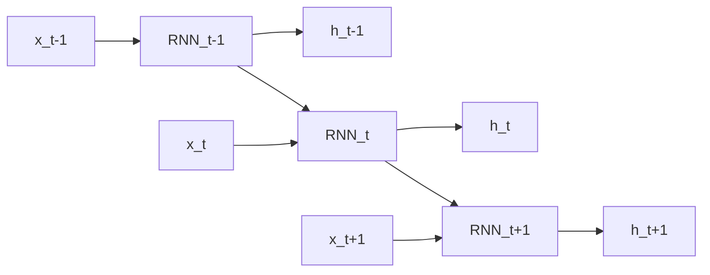
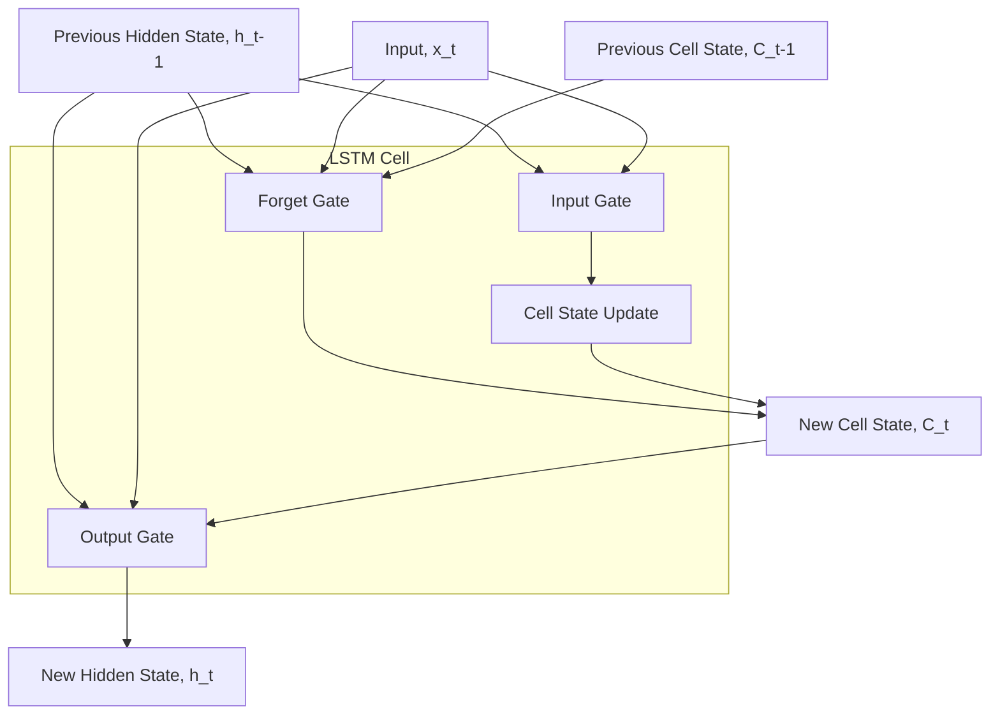
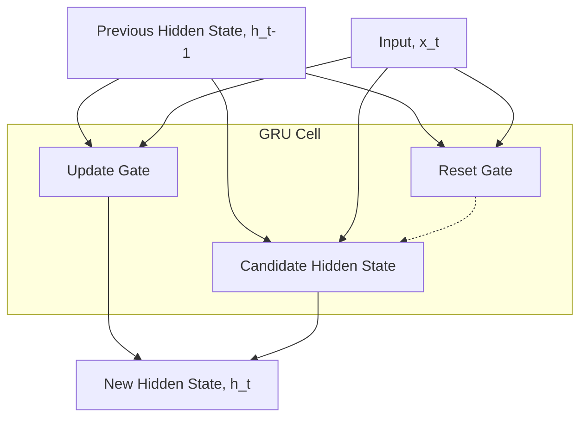

# Day 6 – RNNs, LSTMs, and GRUs

## 1. Recurrent Neural Networks (RNN)
**Concept:** RNNs are designed to recognize patterns in sequences of data, such as text, genomes, handwriting, or spoken words. Unlike standard feedforward neural networks, RNNs have a "memory" which captures information about what has been calculated so far.
*   **Hidden State:** The network passes a hidden state from one time step to the next, representing the network's memory.

## 2. Vanishing Gradient Problem & Temporal Dependencies
*   **Vanishing Gradient:** When training artificial neural networks with gradient-based learning methods and backpropagation, the gradients (useful for weight updates) often get smaller and smaller as they propagate backward through time. This stops the early layers from learning.
*   **Temporal Dependencies:** Because of the vanishing gradient, vanilla RNNs struggle to learn long-range temporal dependencies (e.g., remembering a word from the beginning of a long paragraph).

## 3. Long Short-Term Memory (LSTM)
**Concept:** LSTMs are a special kind of RNN, explicitly designed to avoid the long-term dependency problem. They introduce a cell state ($C_t$) and three gates to carefully regulate the flow of information.
*   **Forget Gate:** Decides what information we're going to throw away from the cell state.
*   **Input Gate:** Decides what new information we're going to store in the cell state.
*   **Output Gate:** Decides what we're going to output based on our filtered cell state.

## 4. Gated Recurrent Unit (GRU)
**Concept:** The GRU is a newer generation of RNNs and is comparable to LSTM. They effectively solve the vanishing gradient problem using a simpler architecture (fewer parameters).
*   **Update Gate:** Similar to the forget and input gates of an LSTM model combined. It decides what information to throw away and what new information to add.
*   **Reset Gate:** Decides how much of the past information to forget.

