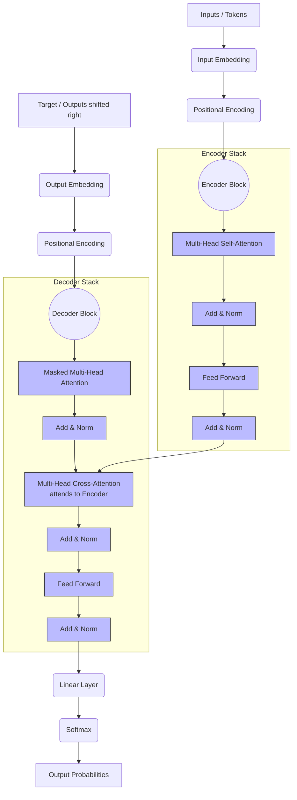

# Day 7 – Transformer Architecture

## 1. Attention Mechanism & Self-Attention
*   **Attention:** A mechanism that allows the model to selectively focus on different parts of the input sequence when producing an output, rather than treating all inputs equally (like a bottleneck in traditional models).
*   **Self-Attention:** An attention mechanism relating different positions of a *single* sequence to compute a representation of the sequence. It calculates a score (Query, Key, Value mapping) to determine how much focus to put on other words for a given word.

## 2. Multi-Head Attention
*   Instead of performing a single attention function, Transformers project the queries, keys, and values $h$ times in parallel. 
*   This allows the model to jointly attend to information from different representation subspaces at different positions. Overlapping heads capture multiple simultaneous relationships (e.g., subject-verb, adjective-noun).

## 3. Positional Encoding
*   Because Transformers do not use recurrence (RNNs) or convolution (CNNs), they have no concept of word order by default.
*   **Positional Encodings** are injected into the input embeddings at the bottoms of the encoder and decoder stacks. This mathematical formulation uses sine and cosine functions of different frequencies to give the model information about the relative or absolute position of the tokens in the sequence.

## 4. Encoder-Decoder Structure & Architecture Map
*   **Encoder:** Processes the input sequence iteratively. Contains Multi-Head Attention and Feed-Forward layers.
*   **Decoder:** Generates the output sequence conditionally. Contains Masked Multi-Head Attention (to prevent looking into the future), Multi-Head Attention over Encoder outputs, and Feed-Forward layers.

### Transformer Concept Map

